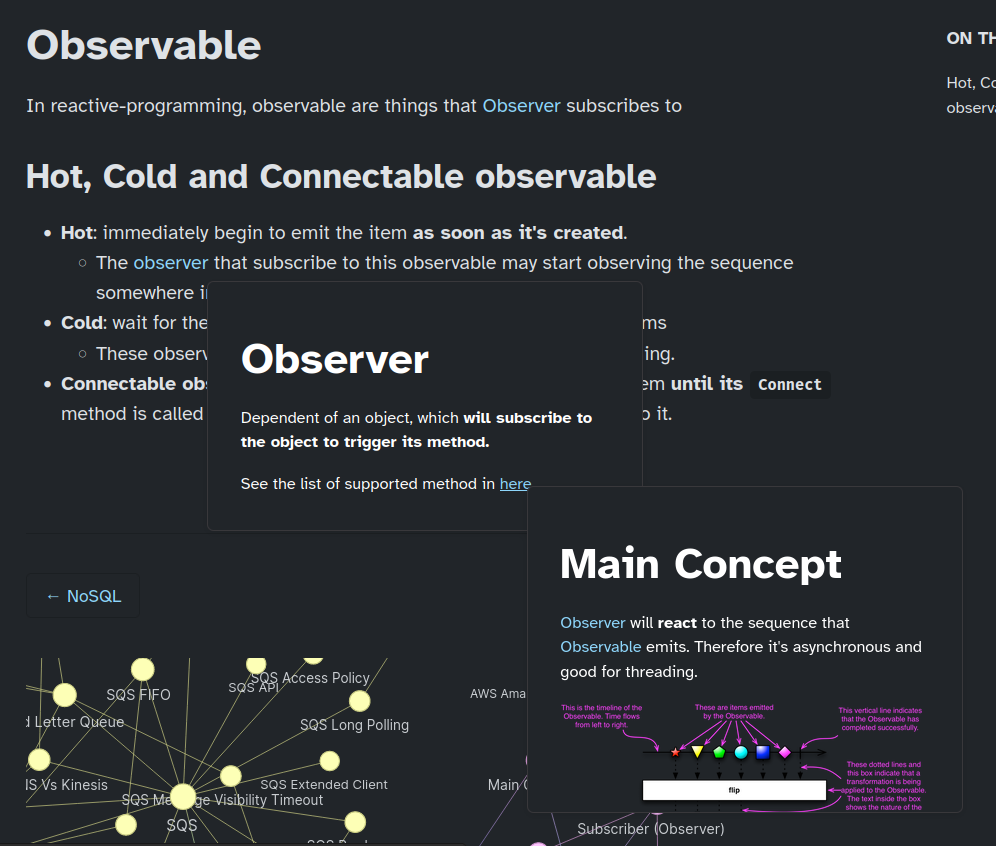
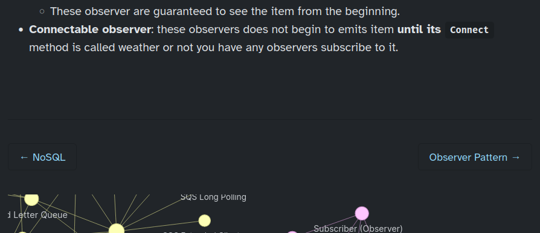
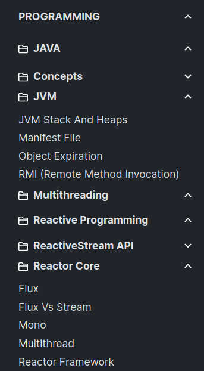
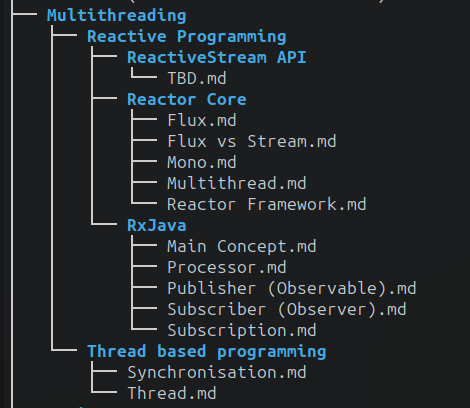

Swipe up for English
# السلام عليكم ورحمة الله وبركاته

### الأداة فيها تعديلات @rockmanvnx6 جزاه الله خيرا، وعدلت أنا بعض التعديلات

1. أضفت `dir='auto'` لملف `base.html` كي ينقلب اتجاه الصفحة من `اليمين لليسار` لـ `اليسار لليمين` أو العكس بحسب اللغة،  حيث أن  مثلا العربية لا تستطيع قراءتها إن كانت مكتوبة من `اليسار لليمين`
2. الـ footer أفرغته، حتى يسهل على من يريد استخدام الأداة أن يستخدم فقط ملف ال toml لوضع الـ footer الخاص به إن أراد
3. ألغيت أن يتم عمل uppercase لأسماء الفولدرات في الـ sidebar كي تكون أسهل في القراءة
4. أضفت زر الـ `CD` 'Change Direction' في أعلى الصفحة في الـ navbar حتى يسهل عكس اتجاه الصفحة من `اليمين لليسار` لـ `اليسار لليمين` والعكس حسب الحاجة
مثال: في حالة كان المحتوى والكلام الأساسي بالعربي لكن عندك بعض الفولدرات باللغة الانجليزية، فسيكون من الصعب قراءة أسماء الفولدرات بهذا الاتجاه `اليمين لليسار`، لذا فقط اضغط على الزر `CD` أعلى الشاشة.
5. أزلت أيقونة الفولدر من أمام الفولدرات التي تكون داخل الفولدرات الأكبر في الـ Sidebar
6. داخل ملف الـ converter.py استخدمت ChatGPT لتعديل الكود لإنه كان بيحدث خطأ لما أرفع ملف ليس .md


### ما أريد إضافته؟
- كل عنصر في الموقع يكون له الـ dir='auto'
لإن الوضع الحالي إن اتجاه الصفحة بيحدد حسب العنوان، فلو كان العنوان بالانجليزية لكن أردت أن أكتب جملة أو شيء ما بالعربية، ستكون بنفس اتجاه الصفحة، الاتجاه الخاطئ في هذه اللحظة `اليسار لليمين`

####
# May the peace, blessings, and mercy of God be upon you

### The tool has @rockmanvnx6's modifications, may God reward him, and I made some modifications

1. Added `dir='auto'` to the `base.html` file so that the page direction flips from `right to left` to `left to right` or vice versa depending on the language, since `Arabic, Hebrew, Persian, Urdu, Kashmiri, Pashto, Uighur, Sorani Kurdish, and Sindhi` cannot be read if it is written from `left to right`
2. Removed the footer from home page, so that it is easy for anyone who wants to use the tool to just use the toml file to put his own footer if he wants.
3. Canceled the uppercase for folder names in the sidebar so that they are easier to read
4. Added the `CD` button to `Change Direction` at the top of the page in the navbar so that it is easy to reverse the direction of the page from `right to left` to `left to right` and vice versa as needed.
Example: If the content and main content are in Arabic or any `rtl lang`, but you have some folders in English, it will be difficult to read the folder and subfolders/files names in current direction `right to left`, so just press the `CD` button at the top of the screen.
5. Removed the folder icon in front of the folders that are inside the larger folders in the Sidebar
6. Inside the converter.py file, I used ChatGPT to modify the code because an error occurred when I uploaded a file that was not .md.

### What do I want to add?
- [ ] Every element on the site has the dir='auto'
because the current situation is that the direction of the page is determined by the title. If the title was in English but I wanted to write a sentence or something in Arabic, it would be in the same direction as the page, the wrong direction at this moment. Left to right`

#### <a href="https://github.com/ppeetteerrs/obsidian-zola#setup" target="_blank">خطوات الاستخدام - How to use</a>

The end.

---
Live: [https://swe.auspham.dev/](https://swe.auspham.dev/)

# This fork has

1. Nested preview


2. Docs navigation previous/next


3. Nested folder structure supported. Thanks [@DoNotResuscitate](https://github.com/DoNotResuscitate/) for finding and fixing bugs

 


# If you're using this fork:

For this to work, please use this netlify.toml or change the one which is marked as `IMPORTANT`

This has been configured properly for page previous/next with the graph settings


```toml
[build]
command = "rm -rf __obsidian __site && git clone https://github.com/rockmanvnx6/obsidian-zola.git __site && __site/run.sh || true"
publish = "public"

[build.environment]
# (Optional) Text in landing page button
LANDING_BUTTON = "Go to notes"
# (Optional) Site description on landing page
LANDING_DESCRIPTION = "Contains AWS, system design, and some random stuff"
# (REQUIRED) The Markdown page linked to landing page button (e.g. put home for ./home.md)
LANDING_PAGE = "home"
# (Optional) Site title on landing page
LANDING_TITLE = "My SWE notes 💖"
PYTHON_VERSION = "3.8"
# (REQUIRED) Site repo URL
REPO_URL = "https://github.com/rockmanvnx6/notes"
# (Optional) Site title in navbar
SITE_TITLE = "Austin's SWE Notes 😭"
# (Optional) Site title in browser tab (leave blank to use SITE_TITLE)
SITE_TITLE_TAB = ""
# (REQUIRED) Netlify site URL
SITE_URL = "https://swe.auspham.dev/"
# (Optional) Site Timezone
TIMEZONE = "Australia/Melbourne"
ZOLA_VERSION = "0.15.2"
# IMPORTANT
SORT_BY = "weight"
# (Optional) Google Analytics Measurement ID
GANALYTICS = ""
# (Optional, default true) Slugify URLs. Put "" to disable.
SLUGIFY = "y"
# (Optional, default true) Shows knowledge graph on home page. Put "" to disable.
HOME_GRAPH = "y"
# (Optional, default true) Shows knowledge graph on every page. Put "" to disable.
PAGE_GRAPH = "y"
# (Optional, default false) Whether sidebar sections should be collapsed by default.
SIDEBAR_COLLAPSED = "true"
# (Optional, default blank) Additional footer content.
FOOTER = ""
# (Optional, default main) Root section name.
ROOT_SECTION_NAME = "main"
# IMPORTANT
GRAPH_OPTIONS = """
        {
			autoResize: true,
        	nodes: {
        		shape: "dot",
        		color: isDark() ? "#8c8e91" : "#dee2e6",
        		font: {
        			face: "Inter",
        			color: isDark() ? "#c9cdd1" : "#616469",
        			strokeColor: isDark() ? "#c9cdd1" : "#616469",
        		},
        		scaling: {
        			label: {
        				enabled: true,
        			},
        		},
        	},
        	edges: {
        		color: { inherit: "both" },
        		width: 0.8,
        		smooth: {
        			type: "continuous",
				roundness: 1
        		},
        		hoverWidth: 4,
        	},
        	interaction: {
        		hover: true,
        	},
        	height: "100%",
        	width: "100%",
        	physics: {
				solver: "forceAtlas2Based",
				stabilization: false
        	},
        }
        """


```